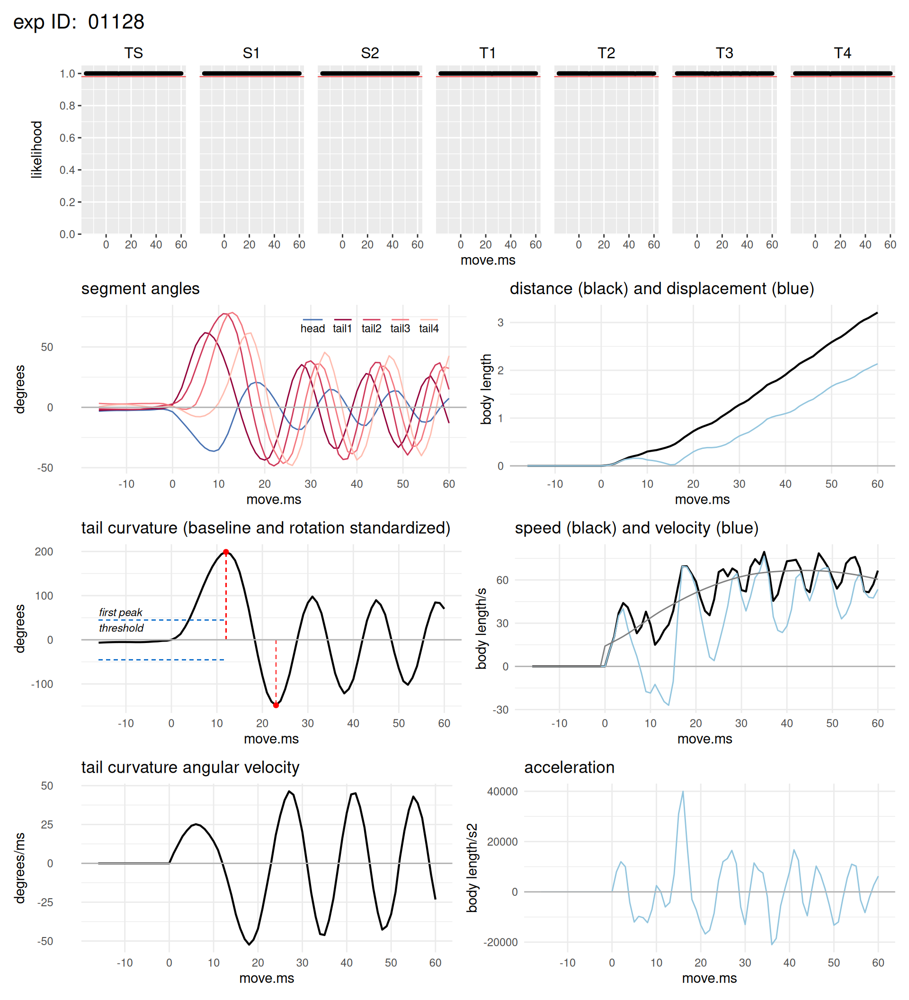
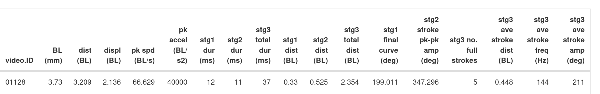

```{r, include = FALSE}
knitr::opts_chunk$set(
  collapse = TRUE,
  comment = "#>"
)
```

<br>

# Rationale

Muscular dystrophies and myopathies result from mutations to genes associated with skeletal muscle structure, biochemistry, or function. Consequently, dystrophies and myopathies are characterized by muscle weakness and impaired mobility. Zebrafish (*Danio rerio*) with mutations in orthologous genes are important pre-clinical models used in the development of new therapies targeting these disorders. Quantifying the mobility of these fish models is therefore a key step in evaluating the efficacy of novel therapeutic treatments. 

<br>

# The problem solved by daniomotion

Zebrafish larvae are small, approximately 4 mm in length, and move very quickly, attaining tail beat frequencies of 50-70 Hz when they are startled. These features make assessing their mobility challenging. 

We recently addressed this challenge by using a kinematic approach to analyze the startle or escape response of wild-type and mutant zebrafish larvae ([Widrick et al.](https://www.biorxiv.org/content/10.1101/2024.12.05.627004v1)). Our approach consists of three steps:

1. Startle or escape responses of 6-7 day post-fertilization zebrafish larvae were recorded using high speed videography.

2. We used the open source toolkit DeepLabCut (abbreviated as DLC) to develop a neural network for rapidly and accurately identifying anatomical keypoints on swimming zebrafish larvae (see Mathis et al. Nat Neurosci 21, 1281–1289, 2018, and Nath et al. Nat Protoc 14, 2152–2176, 2019, for general information about DLC). The pose estimates produced by DeepLabCut consist of keypoint x- and y-coordinates in .csv format (which we will refer to as a DLC .csv file). 

3. The daniomotion package uses these keypoint coordinates to calculate swimming kinematics, a mathematical description of the larva's motion. 

<br>

# Installing daniomotion

Open RStudio and install daniomotion:

    library(devtools)
    devtools::install_github("jjwidrick/daniomotion")
    


<br>

# Prerequisites for using daniomotion

## Video name format

Your videos must be identified by a *numerical* ID. No letters or special characters. The length of this ID number is unimportant but it must only consist of numerical characters. 

For example, our camera is setup to name .mov files consecutively: 01234.mov, 01235.mov, 01236.mov, etc. 


## The settings file

Before using daniomotion you will need to create a plain text file that contains key information about the data collection session. A settings file template (`settings_template.txt`) is included with the daniomotion package. You can copy this template and modify settings for your own project. The settings file has three columns: the *name* of the setting variable, its *value* (which is what you want to edit), and a brief *definition*. Do not delete, modify, or add anything in the *name* column. The setting file must remain in .txt format.

One critical bit of information contained in the setting file is the length calibration of your camera system. We recommend that you calibrate at the beginning of each daily data collection session. With our camera, we acquire an image of a small section of a ruler, open the image in ImageJ, use the straight line tool to draw a line of known length, and use the `Set Scale` function under the `Analyze` tab to calculate pixels per mm. This value is entered for `pix.per.mm` in the setting file. Other values and parametres in the setting file are described in our paper ([Widrick et al.](https://www.biorxiv.org/content/10.1101/2024.12.05.627004v1). 

We also recommend incorporating some time element into the settings filename so that in the future you can unequivocally match it with the DLC files produced that day. In our scheme, '20250305_settings.txt' would contain the settings used when collecting data on March 5, 2025.

 

   
## The metadata file

You will need a metadata file that includes information about your fish, such as strain, phenotype, genotype, age, treatment, etc., as well as the video ID number(s) corresponding to this fish (the same video ID discussed above). 

The metadata file is useful because not all of the information you want linked to a fish may be known on the day you measure its swimming performance. For instance, you may not know the genotype of a fish until several days or weeks after video collection. This information can easily be entered into the metadata file. The `dm_aggregate` function, part of daniomotion, merges information in the metadata file with your existing kinematic results. 

A metadata template (`metadata_template.csv`) is provided for you to copy and modify. Again, modify only the values; do not add or delete columns or change column headings. Enter "NA" for variables or cells that are not used. Our future plans are to make the metadata file more flexible but currently it is important to use the template as presented. 

Note that the metadata file must remain in .csv format.


<br>

# Calculating kinematics

Swimming kinematics are calculated using the `kin_process` function of `daniomotion`. We have provided three Rmarkdown templates to assist in configuring and using the `kin_process` function.

  - **DAQ_mode_template.Rmd**. Use this mode when you are collecting data. This mode enables you to analyze each DLC .csv file as they are created. This is useful because you can view the results and judge whether the trial was acceptable (for instance, did you collect sufficient data, is keypoint tracking accurate, etc).
    - This template should be placed in the same directory that receives videos from your camera.
    - This directory should also contain your current settings.txt file. This settings.txt file can be the ONLY .txt file in this directory.
    - When you collect a video, download it into this directory. Have DeepLabCut configured to extract coordinates and save the resulting .csv file to this same directory
    - Place the dd_DAQ_mode_template.Rmd in this directory and open using RStudio (making the directory the working directory). 
    - Follow the directions in the Rmd to configure, then knit. Results will be sent to this same directory.
    - Only ONE .csv file, the one you are currently analyzing, can be in this directory. So, after analysis, you will need to move the DLC .csv and your dataframes out of this directory into another directory  

    
  - **single_mode_template.Rmd**. If you use DAQ mode as you are collecting data, you will have all of your kinematic results seconds after collecting the video. However, sometimes you may want to revisit and reanalyze a single DLC .csv file. Single mode enables you to identify this DLC file and conduct the kinematic analysis. Note that you will need to specify the directory, the 'data_dir', containing the DLC .csv file. The setting.txt file for the specific DLC .csv file must also be in 'the same directory'data_dir' and it can be the only .txt file in this directory.
    
  - **batch_mode_template.Rmd**. If you need to re-analyze multiple DLC .csv files, use batch mode. Note that this template will analyze all .csv files in the specified directory. Only DLC .csv files can be in the directory. Furthermore, all of these DLC .csv files must use the same setting/txt file AND the settings.txt file can be the only .txt fikle in the directory. 
    
The template contains instructions for setting up each analysis mode. Note that it is critical that `daniomotion` and your DLC .csv file(s) are in the appropriate directories (follow the instructions in the template).

## An analysis example

In this example, our video ID is `01128`. After recording the video and running our DeepLabCut neural network to extract keypoint coordinates, we have a file named `DLC01128...lots of DLC info...csv`. This file contains the keypoint coordinates for each frame of your video.

Running the `DAQ_mode_template.Rmd`, which calls `kin_process`, generates the following files that will be saved to the current directory:

- A dataframe labelled `01128_all_ms.csv` consisting of kinematic variables vs. time, i.e. values calculated at every ms of the trial.
- A dataframe labelled `01128_one_row.csv` consisting of summary kinematics (means across trials) describing the trial.
- You may have a dataframe labelled `01128_pk_vl_df.csv` that consists of the transition points between escape response stages. This file does not normally need to be saved (the option is available because the file is sometimes useful for diagnostic purposes). By setting `pk_vl_save = FALSE` this file will not be saved.

If `plot = TRUE`, daniomotion will produce plots of the kinematic results (in html format). Here is an example of the plot output:  

{width=100%}

- The top row shows the likelihood values across time for each keypoint. A red line indicates the likelihood criteria specified in the settings file.

- The second row, left column is a plot of the angle of each tail section and the head section. Responses are smoothed based on the criteria in the settings file.

- The second row, right column is a plot of distance and displacement vs. movement time. Linear kinematics are calculated from the keypoint specified in the settings file. In this example, it is calculated from keypoint S2.

- The third row, left column shows tail curvature (the sum of each tail segment angle) vs movement time. It also shows the threshold (specified in the settings file) for detecting the C-start and the point identified as the curvature of the tail at the stage 1 to stage 2 transition (maximum C-start tail curvature).

- The third row, right column plots speed and velocity. Smoothed speed (based on criteria in the setting file) is indicated by the light grey line.

- The fourth row, left column is a plot showing the tail curvature angular velocity vs movement time.

- The fourth row, right column is a plot of acceleration vs movement time.

Selected kinematic data summarizing the trial are printed at the bottom of the output. These results are derived from the `by_ms.csv` and `one_row.csv` dataframes produced by `dd_kinematics`

{width=100%}

See [Widrick et al.](https://www.biorxiv.org/content/10.1101/2024.12.05.627004v1) for more details on kinematic calculations, smoothing, etc.


<br>


# Aggregrating results

The `kin_process` function produces two (or three if you set `pk_vl_save` to TRUE) dataframes per fish. At some point, you will want to do two things: 1) combine these individual data frames into a larger dataframe for further analysis, and 2) merge in descriptive metadata (for example, fish strain, genotype, age, etc.). These steps are accomplished by the `dd_compile` function. 

We have provided an Rmarkdown template, `dd_aggregrate_template.Rmd`, to assist in this step. Follow the directions presented in the second chunk of the Rmd to setup your analysis and then knit.

`dd_aggregrate_template.Rmd` calls `dd_aggregrate` which takes the 'by_ms.csv' and the 'one_row.csv' files and creates the following three dataframes:

  - A `by_ms` dataframe that includes results on a ms-by-ms basis for each trial.
  
  - A `by_trials` dataframe that collapses the `by_ms` data over ms so that each row consists of the results of a single trial.
  
  - A `fish_means` dataframe that averages trials across a fish (we typically collect three trials per fish). Each row in `fish_means` represents a single fish with its mean value for each kinematic variable.

Each of these files incorporates the date of the aggregation (in YYMMDD format) so that you can keep track of your most current data.

Before making these three dataframes, `dd_aggregrate` integrates metadata (strain, phenotype, genotype, dpf,treatment, etc.) into each df. `dd_aggregrate` also numbers the fish consecutively to provide a compact fish ID system.

The `by_ms.df`, `by_trials.df`, and `means.df` should be sufficient for further statistical analysis of your results. They are all tidy dataframes. We recommend using the `tidyverse` package for further data manipulation and analysis (Wickham et al. Welcome to the tidyverse. J Open Source Softw 4:1686, 2019 <https://joss.theoj.org/papers/10.21105/joss.01686>). 


   
   
   
